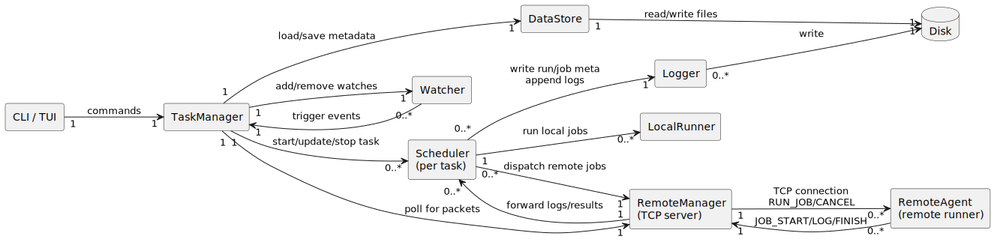
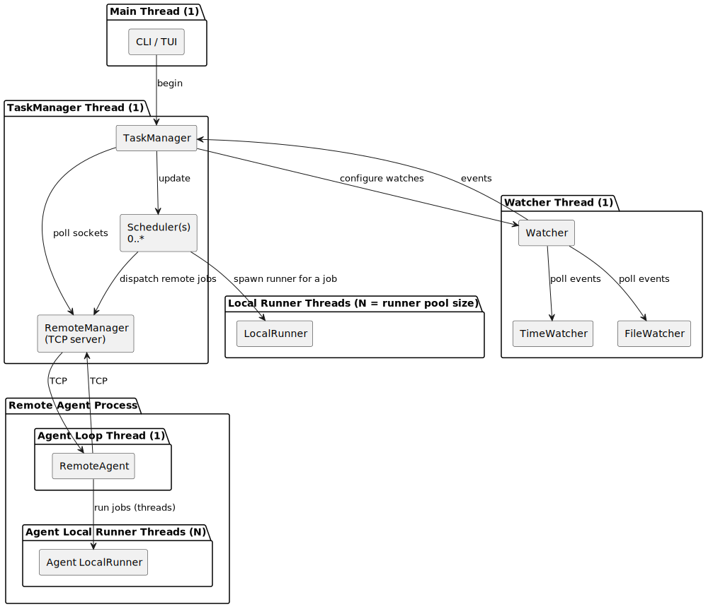
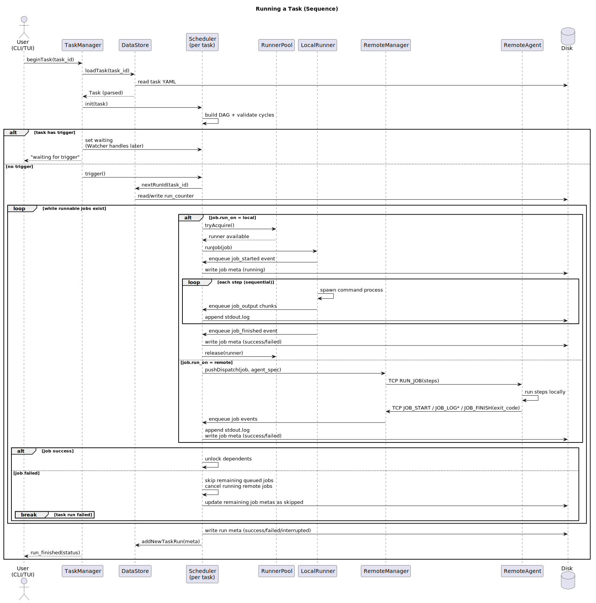

# Architecture

## Component communication


## Thread usage
The information shared between threads is primarily managed using a 
mutex-protected queue, which has push and pop operations.



## Sequence of running a task


## Data structure

The data for task runs and metadata is saved hierarchically. The root data 
directory path can change depending on the found location. It can either be a 
global directory located in the OS-specific application data directory or a 
custom local directory, which is determined by traversing up the current 
directory.

Tasks files (YAML) can be saved anywhere, but the default place is under the 
used data directory. The metadata for tasks, runs, and jobs is stored in JSON 
format.

### Directory hierarchy:

```
.ztask # Location depends on the selected data directory path
  tasks/ # Default location for tasks, can be saved elsewhere
    <task_name1>.yml # Task file (YAML)
    <task_name2>.yml
  data/
    <task_id>/
      run_counter # Counter for amount of task runs
      meta.json  # Task file path, ID, name
      runs/
        <run_id>/
          meta.json # Run ID, start/end time, status, completed jobs
          jobs/
            <job_name>/
              meta.json # Job name, start/end time, status
              stdout.log # Output of executed commands/steps
```

